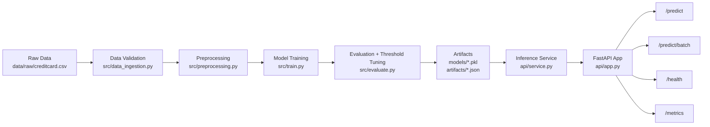
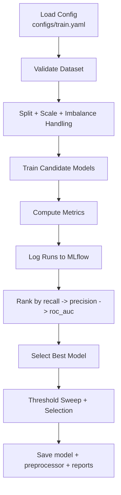
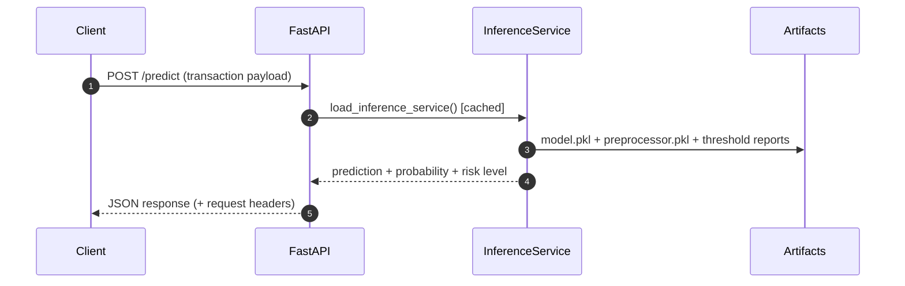
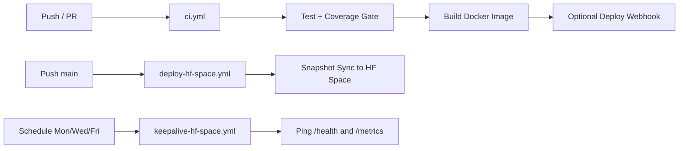

# Fraud Detection MLOps Pipeline

Production-style end-to-end fraud detection system with training, experiment tracking, API serving, containerization, CI/CD, and runtime monitoring.

## Highlights

- End-to-end ML lifecycle: data validation -> preprocessing -> training -> threshold tuning -> API inference.
- Imbalanced classification handling with recall-first model ranking.
- MLflow experiment tracking and artifact logging.
- FastAPI inference service with single/batch prediction endpoints.
- Dockerized deployment with health checks and non-root runtime.
- CI/CD with automated tests, coverage gates, image build, and HF deployment sync.
- Runtime observability via request IDs, structured logs, and `/metrics`.

## Live Deployment

- Hugging Face Space: `https://thasvithu-fraud-detection-mlops-api.hf.space`
- API Docs: `https://thasvithu-fraud-detection-mlops-api.hf.space/docs`

## Architecture



## ML Training Workflow



## Inference Request Flow



## CI/CD and Deployment Workflows



## Project Structure

```text
fraud-detection-mlops-pipeline/
├── api/
│   ├── app.py
│   ├── schemas.py
│   └── service.py
├── src/
│   ├── data_ingestion.py
│   ├── preprocessing.py
│   ├── train.py
│   ├── evaluate.py
│   ├── predict.py
│   └── register_model.py
├── configs/
│   ├── train.yaml
│   └── logging.yaml
├── data/
│   ├── raw/
│   └── processed/
├── models/
├── artifacts/
├── tests/
├── .github/workflows/
│   ├── ci.yml
│   ├── deploy-hf-space.yml
│   └── keepalive-hf-space.yml
├── Dockerfile
├── docker-compose.yml
├── requirements.txt
└── pytest.ini
```

## Tech Stack

- Python 3.11
- Pandas, NumPy, scikit-learn, imbalanced-learn, XGBoost
- MLflow
- FastAPI + Pydantic
- Docker + Docker Compose
- GitHub Actions
- Hugging Face Spaces (Docker SDK)

## API Endpoints

- `GET /health`: Service and model readiness
- `GET /metrics`: Runtime operational counters
- `POST /predict`: Single transaction prediction
- `POST /predict/batch`: Batch transaction predictions
- `GET /docs`: Swagger UI

### Example: Single Prediction

```bash
BASE="https://thasvithu-fraud-detection-mlops-api.hf.space"

curl -X POST "$BASE/predict" \
  -H "Content-Type: application/json" \
  -d '{
    "Time": 0,
    "Amount": 149.62,
    "V1": -1.359807, "V2": -0.072781, "V3": 2.536347, "V4": 1.378155,
    "V5": -0.338321, "V6": 0.462388, "V7": 0.239599, "V8": 0.098698,
    "V9": 0.363787, "V10": 0.090794, "V11": -0.551600, "V12": -0.617801,
    "V13": -0.991390, "V14": -0.311169, "V15": 1.468177, "V16": -0.470401,
    "V17": 0.207971, "V18": 0.025791, "V19": 0.403993, "V20": 0.251412,
    "V21": -0.018307, "V22": 0.277838, "V23": -0.110474, "V24": 0.066928,
    "V25": 0.128539, "V26": -0.189115, "V27": 0.133558, "V28": -0.021053
  }'
```

## Local Setup

### Prerequisites

- Python 3.11+
- `uv`
- Docker (optional, for container run)

### Install

```bash
uv pip install -r requirements.txt
```

### Train

```bash
uv run python -m src.train
```

### Test

```bash
uv run pytest
```

### Run API

```bash
uv run uvicorn api.app:app --reload --host 0.0.0.0 --port 8000
```

## Docker Usage

### Build

```bash
docker build -t fraud-detection-api:latest .
```

### Run

```bash
docker run --rm -p 8000:8000 fraud-detection-api:latest
```

### Compose

```bash
docker compose up --build
```

## Quality Gates

- Test coverage enforced via `pytest.ini`
- Minimum coverage: `>= 80%` across `src` + `api`
- Current status: passing (see GitHub Actions)

## Monitoring and Operations

Runtime metrics exposed by `/metrics`:
- `total_requests`
- `error_count`
- `error_rate`
- `total_predictions`
- `fraud_predictions`
- `fraud_prediction_rate`
- `avg_latency_ms`

Request-level observability:
- `X-Request-ID`
- `X-Process-Time-Ms`
- Structured JSON logs for request and prediction events

## GitHub Actions Workflows

- `ci.yml`: test + coverage + image build (+ optional webhook deploy)
- `deploy-hf-space.yml`: sync `main` to Hugging Face Space
- `keepalive-hf-space.yml`: scheduled pings to reduce Space inactivity sleep

## Required GitHub Secrets

For Hugging Face deploy:
- `HF_TOKEN`
- `HF_SPACE_REPO` (format: `username/space-name`)

For HF keepalive:
- `HF_SPACE_URL`

Optional webhook deploy:
- `DEPLOY_WEBHOOK_URL`

## Milestone Status

All planned phases (0-9) are complete:
- Foundation
- Data validation
- Preprocessing
- Training + MLflow tracking
- Evaluation + threshold tuning
- FastAPI inference service
- Testing + quality gates
- Containerization
- CI/CD automation
- Monitoring and operations

## License

MIT (see `LICENSE`)
